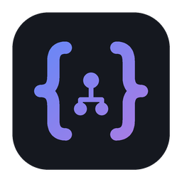
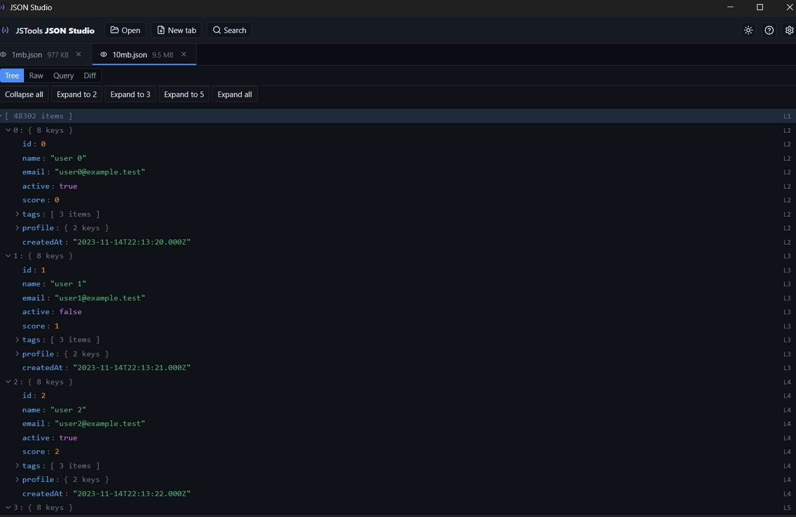

<div align="center">



# JSTools JSON Studio

**A private desktop workspace for exploring, querying and comparing JSON.**

Open huge JSON, JSONL and NDJSON files, browse them as a fast virtualized tree,
search and run JSONPath queries, diff two documents, and inspect line‑delimited
records — all **100% locally**. No network, no telemetry, no accounts.

<!-- Drop a screenshot at docs/screenshot.png -->


</div>

---

## Why JSON Studio

Most JSON viewers choke on large files, round your big numbers, or quietly send
your data somewhere. JSON Studio is built for serious, **offline** work:

- **Lossless** — big integers, high‑precision decimals, key order and the exact
  source text are preserved. `9223372036854775807` and `0.1234567890123456789`
  stay exactly as written.
- **Handles large files** — documents are memory‑mapped and the views are
  virtualized, so opening hundreds of megabytes stays responsive.
- **Private by design** — everything runs on your machine. No HTTP, no analytics,
  no cloud (see [PRIVACY.md](PRIVACY.md)).

## Features

- **Tree view** — virtualized JSON tree with collapse/expand, expand‑to‑depth and
  expand‑all, type & item‑count badges, source line markers, full keyboard
  navigation, a node **detail panel** (full path + value with one‑click copy),
  and a right‑click menu to copy value / key / object / **JSONPath** /
  **JSON Pointer** / raw, or expand/collapse a subtree.
- **Image preview** — string values that are `data:image/…` URIs or bare base64
  (PNG, JPEG, GIF, WebP, SVG) get an inline 🖼 button to view the decoded image
  in a modal — handy for avatars and thumbnails embedded in JSON.
- **Jump to node** — clicking a Search or JSONPath result expands its ancestors
  and scrolls straight to it in the tree.
- **Raw view** — the exact source with line numbers, word wrap, go‑to‑line,
  jump‑to‑parse‑error (with the precise error location), and one‑click
  **Copy pretty / Minify / Save** of the re‑serialized document.
- **Search** (`Ctrl/Cmd+F`) — across keys and/or values, with case sensitivity,
  whole‑field match, **regular expressions**, subtree scoping, match count and
  next/previous navigation.
- **JSONPath query** (`Ctrl/Cmd+Enter`) — RFC 9535 queries with per‑document
  history, execution time, result count, copy paths / copy result, and export to
  JSON or JSONL.
- **Diff** — structural comparison of two open documents (key order ignored).
  Match arrays **by index** or **by a key field**, filter by added / removed /
  changed, and jump to either side.
- **JSONL / NDJSON table** — line‑delimited records as a virtualized table with
  selectable columns, field statistics, invalid‑row highlighting and
  jump‑to‑line.
- **Paste & scratch tabs** — paste JSON straight into a new tab, edit it in place,
  compare two pasted payloads, and save to a file when ready.
- **Tabs & sessions** — multiple documents in tabs; open files are remembered and
  reopened on next launch.
- **Live reload** — when an open file changes on disk, reload on demand or enable
  auto‑reload.
- **Settings** — theme (System/Light/Dark), font size, line height, indent,
  default view, expand depth, memory limits and more — all stored locally.
- **Accessible** — keyboard‑navigable tree, ARIA roles, visible focus, and a
  shortcuts overlay (press `?`).

### Supported formats

`.json` · `.jsonl` · `.ndjson`

## Install

Download the latest installer for your OS from the
[**Releases**](../../releases) page:

| OS | File |
|----|------|
| Windows | `.msi` or `*-setup.exe` |
| macOS | `.dmg` (Apple Silicon and Intel) |
| Linux | `.AppImage` or `.deb` |

> The app isn't code‑signed yet, so the OS may warn on first launch.
> **Windows:** *More info → Run anyway*. **macOS:** right‑click the app → *Open*.

## Keyboard shortcuts

| Shortcut | Action |
|---|---|
| `Ctrl/Cmd + O` | Open file |
| `Ctrl/Cmd + F` | Search |
| `Ctrl/Cmd + W` | Close active tab |
| `Ctrl/Cmd + Shift + D` | Diff view |
| `Ctrl/Cmd + Enter` | Run JSONPath query |
| `↑ / ↓` | Move in tree |
| `→ / ←` | Expand / collapse (or move to child / parent) |
| `Enter / Space` | Toggle node |
| `?` | Show all shortcuts |
| `Esc` | Close menu / panel / dialog |

## Privacy

JSON Studio never makes network requests and collects no telemetry. Files are
read locally; recent files and settings are stored only in your OS app‑config
directory and can be cleared from **Settings → Clear local history**. Details in
[PRIVACY.md](PRIVACY.md).

## Build from source

Requirements: Node ≥ 20, pnpm 9, the Rust toolchain, and the
[Tauri 2 prerequisites](https://v2.tauri.app/start/prerequisites/).

```bash
pnpm install
pnpm dev      # run in development
pnpm build    # produce installers (in apps/json-studio/src-tauri/target/release/bundle)
```

More for contributors: [ARCHITECTURE.md](ARCHITECTURE.md) ·
[PERFORMANCE.md](PERFORMANCE.md) · [RELEASE.md](RELEASE.md) ·
[ROADMAP.md](ROADMAP.md)

## License

MIT
